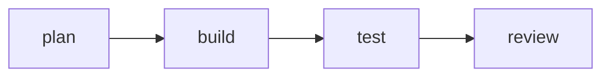
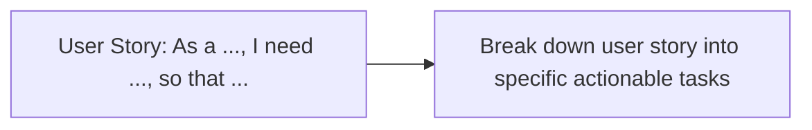
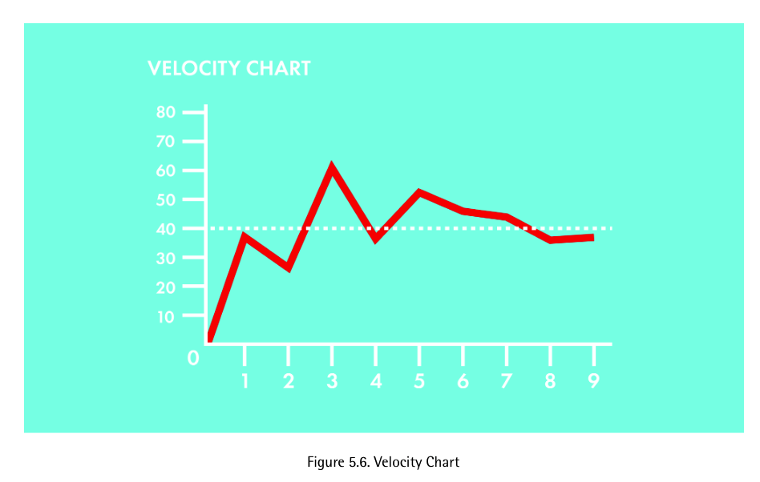
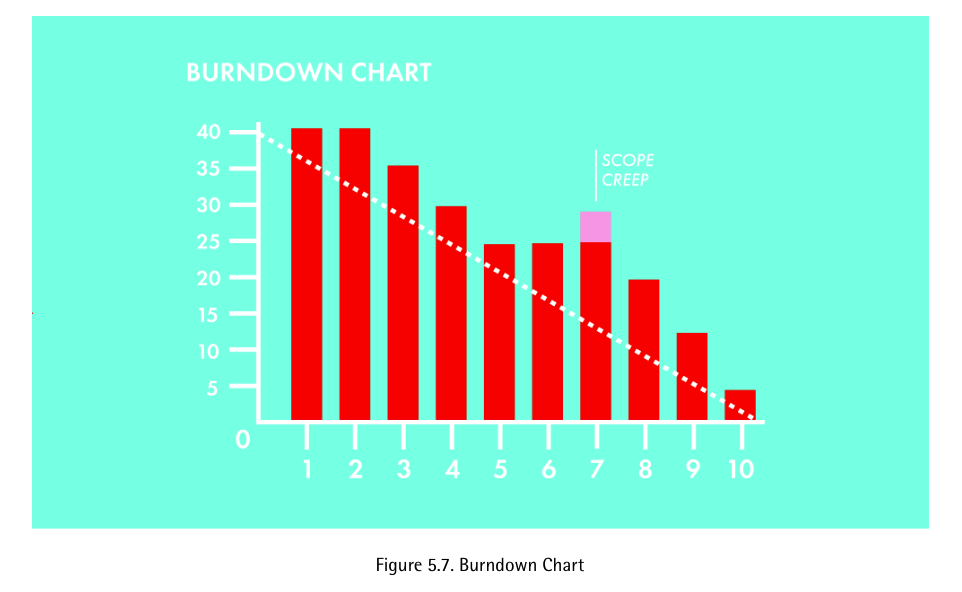
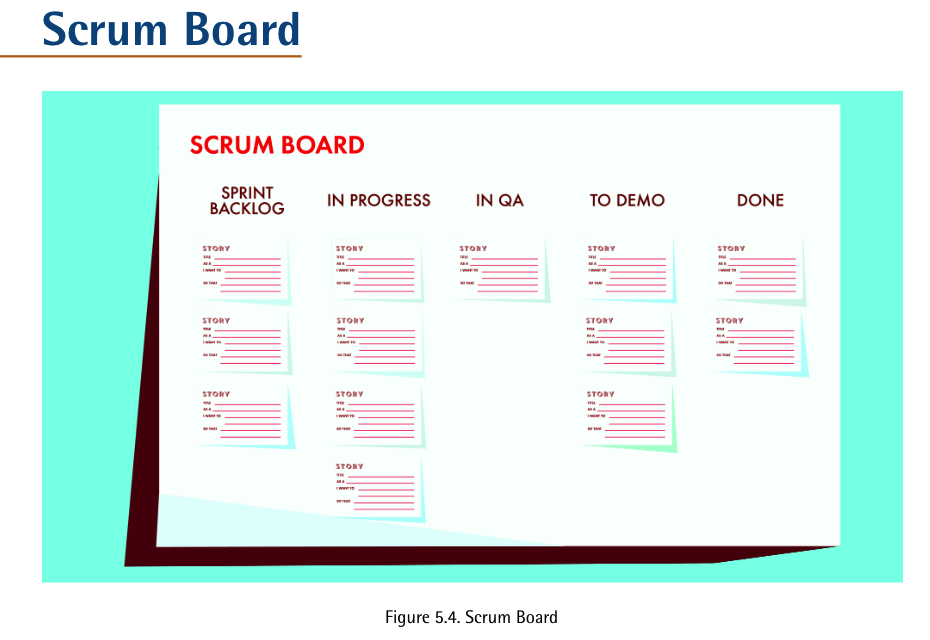

# Scrum 

## Workflow 
One full sprint contains four stages:

## Roles
### product owner 
ideate and creative mind

### scrum master 
leader of the team, keeps the scrum in check

### team members 
diverse, full of specialties

## Rituals
*See Chapter 4 'Scrum Rituals' in [Scrum Ninja](./resource/ScrumNinja.pdf)*
### Sprint planning
> The purpose of the sprint planning is to set the agenda for the upcoming sprint. The team gets together with the product owner and the scrum master to get an introduction to the stories that should be completed during the next sprint.

### Daily standup
>The purpose of the daily standup is to give everybody on the team an opportunity to share the status of the work they're doing, and get help if anything is blocking their progress. 

Three questions:
- Did: i did - ___________ 
- Do: ill do this - ________________
- Obstacle: difficulties or help needed - ________________

### Sprint Retrospective(Review)
> Sprint retrospectives offer the team the opportunity to reflect on what they've been doing at the end of every sprint, and figure out how they want to modify their process going forward.

## Artifacts 
*See Chapter 5 'Scrum Artifacts' in [Scrum Ninja](./resource/ScrumNinja.pdf)*
### User Stories
> Stories are how the product owner communicates to the development team what needs to be developed. 

> Stories are incubated in the product backlog, and then expressed in a standard format so they can be presented to the team as part of the sprint planning meeting to be evaluated, estimated, and then included in a sprint backlog.

### product backlogs

Check YouTube example [Scrum in 20 mins... (with examples)](https://youtu.be/SWDhGSZNF9M?t=916) on how to create product backlogs.

> The Product Backlog is the Responsibility of the Product Owner. It may not be productive to keep reminding the team of items on the product backlog that haven't been touched in a long time. 

> Unlike stories for the sprint backlog, items for the product backlog don't need to be structured in any particular way. The main purpose is to allow the product owner to keep track of all of the features that are needed. 

> There doesn't have to be a one-to-one correspondence between items in the product backlog and stories that make it into the sprint backlog. 

### sprint backlogs
> The sprint backlog is the set of developer stories that the team has committed to working on during the current sprint. 

> A sprint backlog is created as part of the sprint planning ritual, and reflects the shared understanding of the team, the product owner, and the scrum master of what everybody will be working on for the coming sprint.

Pick the most **IMPORTANT**(e.g., enable to connect with other players is more important than graphics) user story, break down features that need to be implemented.

> Each story is estimated during the sprint planning, and the backlog as a whole should represent the total number of points that the team believes it can accomplish in the upcoming sprint. Each story has a **POINT** value, and that reflects the amount of work the team believes will be necessary to complete that particular story.

Story **POINT** is required for velocity chart and burndown chart

### velocity & burndown chart

    

Velocity chart is how a scrum team measures the amount of work they can complete in a typical sprint. 

    

A burndown chart shows the team's progress toward completing all of the points
they agreed to complete within a single sprint.

## TODO:
1. Create Sprint Board on Trello!

    

2. the product backlog, 
product owner builds a list of ideas and features that could go into the product 

3. sprint planning 
the list of ideas and features is discussed with everyone to narrow down what can go into the next sprint (next step)

4. sprint backlog
means that we would take the user stories and ideas that we picked in the previous meeting and pick out the missing pieces to work on during the actual sprint 

